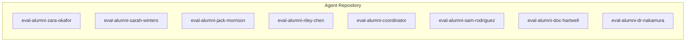
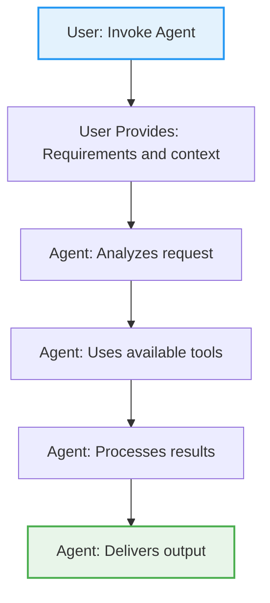

# Eval Alumni - Expert Evaluation Committee System

## Agent Workflow Diagrams

This section provides visual workflows for the agents in this repository.

### Quick Reference



### Typical Agent Usage Pattern



**Common workflow**:
1. **Invoke**: User calls agent with task description
2. **Input**: User provides necessary context/requirements
3. **Analysis**: Agent analyzes the request
4. **Tool Usage**: Agent uses Read, Write, Edit, Bash, etc.
5. **Processing**: Agent processes tool results
6. **Output**: Agent delivers final results


> **Professional code and system evaluation from 7 distinct expert perspectives plus comprehensive committee coordination**


## 🎯 What is Eval Alumni?

Eval Alumni is a comprehensive evaluation system that provides professional assessment of code, systems, and projects through the lens of 8 domain-weighted expert personas (7 general + the Codification Judge), plus a coordinator that orchestrates full committee evaluations and a mandatory Adversary reviewer that can cap a mediocre score after the domain experts have scored. Each expert brings unique expertise and perspective, creating a well-rounded assessment framework.

**Key Features:**
- ✅ **Safe to run in dangerous mode** - All agents are read-only evaluators
- 🏆 **Professional scoring and reporting** with detailed recommendations
- 👥 **Individual expert consultations** or **full committee evaluation**
- 📊 **Comprehensive Task* tools integration** for progress tracking
- 🔍 **Deep domain expertise** covering all aspects of system quality

## 👥 Meet the Evaluation Committee

### The 7 Expert Evaluators

| Expert | Specialty | Focus Areas | Personality |
|--------|-----------|-------------|-------------|
| **[Doc Hartwell](agents/eval-alumni-doc-hartwell.md)** | Technical Correctness | Algorithms, design patterns, code quality | Grumpy sage with 40+ years experience |
| **[Riley Chen](agents/eval-alumni-riley-chen.md)** | UX & Product | User experience, workflow optimization | ADHD Product Manager, rapid-fire insights |
| **[Dr. Nakamura](agents/eval-alumni-dr-nakamura.md)** | Claude AI Systems | AI best practices, prompt engineering | Calm AI systems whisperer |
| **[Sam Rodriguez](agents/eval-alumni-sam-rodriguez.md)** | Accessibility | Cognitive accessibility, architecture | Direct systems thinker, neurodiverse champion |
| **[Jack Morrison](agents/eval-alumni-jack-morrison.md)** | Practical Implementation | Real-world feasibility, maintenance | No-BS implementer, "will it work at 2 AM?" |
| **[Sarah Winters](agents/eval-alumni-sarah-winters.md)** | Security & Deployment | Security vulnerabilities, data privacy | Paranoid guardian with military precision |
| **[Zara Okafor](agents/eval-alumni-zara-okafor.md)** | Documentation & Community | Developer experience, community health | Enthusiastic community bridge builder |

### The Codification Judge

| Expert | Specialty | Focus Areas | Personality |
|--------|-----------|-------------|-------------|
| **[Codification Judge](agents/eval-alumni-codification-judge.md)** | Codification Readiness | Whether prompt-only behavior should move into code, metadata, schemas, or helper tools | Terse, mechanical - "if it repeats, codify it" |

### The Adversary

Not a domain-weighted expert - it runs mandatorily on every committee evaluation as a second
stage after the domain experts have scored, and can cap the committee's reported score when a
major real fault is unaddressed.

| Expert | Specialty | Focus Areas | Personality |
|--------|-----------|-------------|-------------|
| **[Adversary](agents/eval-alumni-adversary.md)** | Fault-finding | The worst real fault in an artifact, unearned praise, bland defaults | Contrarian - "correct is the floor, not the ceiling" |

### The Coordinator

| Role | Responsibility | Capability |
|------|----------------|------------|
| **[Coordinator](agents/eval-alumni-coordinator.md)** | Committee Orchestration | Manages full committee evaluations, synthesizes feedback, resolves conflicts |

## 🚀 Quick Start

### Installation via Claude Code Marketplace (v2.0.0+)

**Recommended**: Install as a Claude Code plugin from your marketplace:

1. Add marketplace to Claude Code settings
2. Search for "AIOS - Eval Alumni Committee"
3. Click "Install" (choose project or global level)
4. Commands instantly available: `/eval`, `/eval-security`, etc.

### Alternative: Direct Installation

Choose your installation method:

#### Global Installation (Recommended)
```bash
cd eval-alumni/
./install.sh --global
```

#### Project-Specific Installation
```bash
cd eval-alumni/
./install.sh --project
```

#### Check Installation Status
```bash
./install.sh --check-versions
```

## 💬 Slash Commands (v2.0.0+)

### Quick Access via Claude Code

When installed as a Claude Code plugin, use these slash commands for instant evaluation:

#### Full Committee Evaluation
```
/eval
```
Invokes the full evaluation committee with all 7 experts + coordinator for comprehensive assessment.

#### Individual Expert Commands

```
/eval-tech       - Technical review (Doc Hartwell)
/eval-pm         - Product management review (Riley Chen)
/eval-ai         - AI systems review (Dr. Nakamura)
/eval-access     - Accessibility review (Sam Rodriguez)
/eval-practical  - Implementation review (Jack Morrison)
/eval-security   - Security review (Sarah Winters)
/eval-docs       - Documentation review (Zara Okafor)
```

**Usage Examples:**
```
/eval           # Full committee evaluation of current work
/eval-security  # Quick security audit
/eval-access    # Accessibility compliance check
/eval-docs      # Documentation quality review
```

## 📝 Agent Invocation (All Versions)

### Basic Usage

#### Individual Expert Evaluation
```bash
# Technical assessment
Use eval-alumni-doc-hartwell to evaluate [your-project] for technical correctness

# UX and workflow evaluation
Use eval-alumni-riley-chen to evaluate [your-project] for user experience

# Security assessment
Use eval-alumni-sarah-winters to evaluate [your-project] for security vulnerabilities

# See all experts below for complete list
```

#### Full Committee Evaluation
```bash
# Comprehensive evaluation from all experts
Use eval-alumni-coordinator for complete evaluation of [your-project]
```

## 📋 Expert Usage Guide

### Individual Expert Invocations

Each expert can be invoked individually for focused assessments:

#### 🔧 Technical Correctness - Doc Hartwell
```bash
Use eval-alumni-doc-hartwell to evaluate [target] for:
- Algorithmic efficiency and design patterns
- Code quality and maintainability
- Technical architecture decisions
```
**Best for:** Code reviews, technical architecture assessment, performance optimization

#### 🎨 UX & Product - Riley Chen
```bash
Use eval-alumni-riley-chen to evaluate [target] for:
- User experience and workflow optimization
- Product-market fit and user adoption
- Interface design and usability
```
**Best for:** Product launches, user interface reviews, workflow optimization

#### 🤖 Claude AI Systems - Dr. Nakamura
```bash
Use eval-alumni-dr-nakamura to evaluate [target] for:
- Claude implementation best practices
- Prompt engineering quality
- AI safety and ethics compliance
```
**Best for:** AI system implementation, prompt optimization, Claude integration

#### ♿ Accessibility & Architecture - Sam Rodriguez
```bash
Use eval-alumni-sam-rodriguez to evaluate [target] for:
- Cognitive accessibility and inclusive design
- Information architecture and findability
- Directory structure and naming conventions
```
**Best for:** Accessibility audits, information architecture, inclusive design

#### ⚙️ Practical Implementation - Jack Morrison
```bash
Use eval-alumni-jack-morrison to evaluate [target] for:
- Real-world implementation feasibility
- Maintenance overhead and operational costs
- Production readiness and reliability
```
**Best for:** Production readiness, maintenance planning, implementation reality checks

#### 🔒 Security & Deployment - Sarah Winters
```bash
Use eval-alumni-sarah-winters to evaluate [target] for:
- Security vulnerabilities and threat assessment
- Data privacy and compliance
- Deployment security and infrastructure
```
**Best for:** Security audits, compliance reviews, deployment security

#### 📖 Documentation & Community - Zara Okafor
```bash
Use eval-alumni-zara-okafor to evaluate [target] for:
- Documentation quality and developer experience
- Community health and contribution workflows
- Open source ecosystem integration
```
**Best for:** Documentation reviews, community building, developer experience

### Committee Coordination

#### 🎭 Full Committee Evaluation - Coordinator
```bash
Use eval-alumni-coordinator for complete evaluation of [target]

# This will:
# 1. Coordinate evaluations from all 7 experts
# 2. Synthesize individual expert reports
# 3. Identify consensus and disagreement areas
# 4. Create comprehensive committee assessment
# 5. Provide executive summary and unified recommendations
```

**Best for:** Comprehensive system assessment, major architecture decisions, production deployments

## 📊 Understanding Evaluation Reports

### Individual Expert Reports

Each expert provides structured reports with:
- **Numerical scores** (0-100) in their specialty areas
- **Detailed findings** with specific recommendations
- **Critical issues** requiring immediate attention
- **Quick wins** for immediate improvement
- **Strategic recommendations** for long-term success

### Committee Reports

The coordinator synthesizes all expert input into:
- **Executive committee summary** with overall assessment
- **Cross-expert analysis** showing consensus and disagreements
- **Unified scoring** across all evaluation dimensions
- **Prioritized action items** with lead expert assignments
- **Committee decision summary** with confidence levels

### Scoring Framework

| Score Range | Meaning | Typical Actions |
|-------------|---------|-----------------|
| **90-100** | Excellent | Minor optimizations only |
| **80-89** | Good | Some improvements recommended |
| **70-79** | Adequate | Several issues to address |
| **60-69** | Needs Work | Significant improvements needed |
| **Below 60** | Critical Issues | Major rework required |

## 🔧 Advanced Features

### Bidirectional Sync

Keep your bundle in sync with installed agents:

```bash
# Sync changes from installed agents back to bundle
./install.sh --sync-back

# Check version status without making changes
./install.sh --check-versions

# Force installation (overwrite newer files)
./install.sh --global --force
```

### Selective Installation

Install only specific components:

```bash
# Install only agents (skip templates)
./install.sh --global --only agents

# Install only templates (skip agents)
./install.sh --global --only templates
```

### Verbose Output

Get detailed information during operations:

```bash
./install.sh --global --verbose
```

## 📁 Bundle Contents

### v2.0.0 Plugin Structure
```
eval-alumni/
├── .claude-plugin/           # Plugin metadata
│   └── plugin.json          # Plugin manifest and configuration
├── .claude/                 # Claude Code integration
│   └── commands/            # 8 slash commands for quick access
│       ├── eval.md         # Full committee evaluation
│       ├── eval-access.md  # Accessibility review
│       ├── eval-ai.md      # AI systems review
│       ├── eval-docs.md    # Documentation review
│       ├── eval-pm.md      # Product management review
│       ├── eval-practical.md  # Implementation review
│       ├── eval-security.md   # Security review
│       └── eval-tech.md       # Technical review
├── agents/                  # 8 evaluation agents
│   ├── eval-alumni-coordinator.md
│   ├── eval-alumni-doc-hartwell.md
│   ├── eval-alumni-riley-chen.md
│   ├── eval-alumni-dr-nakamura.md
│   ├── eval-alumni-sam-rodriguez.md
│   ├── eval-alumni-jack-morrison.md
│   ├── eval-alumni-sarah-winters.md
│   └── eval-alumni-zara-okafor.md
├── templates/              # Required evaluation templates
│   ├── todowrite-integration-template.md
│   ├── structured-choice-template.md
│   ├── validation-checklist-template.md
│   └── operational-protocols-template.md
├── install.sh              # Smart installation script (v1.x compatibility)
├── README.md               # This comprehensive guide
├── VERSION                 # Semantic version (2.5.0)
└── MANIFEST.json          # Complete bundle inventory
```

### v1.0.0 Direct Installation Structure
For users installing via `install.sh`, the traditional bundle structure is maintained for backward compatibility.

## 🎯 Use Cases

### Development Workflow Integration

#### Pre-commit Evaluation
```bash
# Quick technical and security check before commit
Use eval-alumni-doc-hartwell to evaluate [changes] for technical correctness
Use eval-alumni-sarah-winters to evaluate [changes] for security issues
```

#### Feature Review Process
```bash
# Full committee review for major features
Use eval-alumni-coordinator for complete evaluation of [new-feature]
```

#### Architecture Decision Records
```bash
# Get expert input on architectural decisions
Use eval-alumni-jack-morrison to evaluate [architecture-proposal] for practical implementation
Use eval-alumni-dr-nakamura to evaluate [ai-integration] for Claude best practices
```

### Project Lifecycle

#### 🚀 Project Launch
```bash
# Comprehensive readiness assessment
Use eval-alumni-coordinator for complete evaluation of [project-launch]
```

#### 🔄 Regular Health Checks
```bash
# Monthly system health evaluation
Use eval-alumni-riley-chen to evaluate [user-experience] for workflow optimization
Use eval-alumni-zara-okafor to evaluate [documentation] for community health
```

#### 📈 Scaling Preparation
```bash
# Pre-scaling assessment
Use eval-alumni-jack-morrison to evaluate [current-system] for scaling feasibility
Use eval-alumni-sarah-winters to evaluate [infrastructure] for security at scale
```

## 🔒 Safety & Security

### Read-Only Operations
- ✅ **All evaluation agents are read-only** - they never modify your code
- ✅ **Safe for dangerous mode** - no risk of unintended changes
- ✅ **Analysis only** - agents examine and report, never alter

### Expert Credentials
Each expert persona is based on realistic professional backgrounds:
- **Doc Hartwell**: 40+ years computer science experience
- **Riley Chen**: Senior PM managing multiple startups
- **Dr. Nakamura**: AI systems specialist with PhD in NLP
- **Sam Rodriguez**: UX researcher with accessibility expertise
- **Jack Morrison**: 12 years engineering experience
- **Sarah Winters**: Former military cybersecurity captain
- **Zara Okafor**: Developer relations specialist with open source experience

## 🤝 Contributing & Feedback

### Sync Your Improvements
```bash
# After making improvements to installed agents
./install.sh --sync-back
```

### Community Integration

The Eval Alumni system is designed to integrate with broader development communities:

- **Code Review Integration**: Use experts in pull request reviews
- **Architecture Decision Records**: Document expert recommendations
- **Team Training**: Use expert reports for learning and improvement
- **Quality Gates**: Integrate expert scoring into CI/CD pipelines

## 📚 Documentation Standards

Each expert follows comprehensive operational protocols:

- **Task* Tools Integration**: All evaluations use structured task tracking (TaskCreate, TaskUpdate, TaskList)
- **Structured Choice Patterns**: Consistent A/B/C decision frameworks
- **Validation Checklists**: Systematic quality assurance
- **Professional Reporting**: Standardized output formats

## 🔄 Version Management

### Bundle Versioning
- **Semantic versioning** (major.minor.patch)
- **Timestamp-based sync** to prevent conflicts
- **Version conflict detection** with user confirmation
- **Rollback capabilities** for safe operations

### Update Workflow
1. **Check versions**: `./install.sh --check-versions`
2. **Sync changes**: `./install.sh --sync-back` (if you've modified agents)
3. **Install updates**: `./install.sh --global --force` (if bundle is newer)

## 🎓 Best Practices

### Individual Expert Usage
- **Start specific**: Use individual experts for focused assessments
- **Combine perspectives**: Different experts may have conflicting views - that's valuable!
- **Follow recommendations**: Each expert provides actionable next steps
- **Iterate frequently**: Regular expert consultations improve quality over time

### Committee Usage
- **Save for major decisions**: Full committee evaluation is comprehensive but time-intensive
- **Prepare context**: Provide clear scope and objectives for committee review
- **Act on consensus**: When experts agree, prioritize those recommendations
- **Investigate disagreements**: When experts disagree, dig deeper to understand why

### Integration Patterns
- **Pre-commit hooks**: Quick technical and security checks
- **Feature reviews**: UX and implementation feasibility assessment
- **Release readiness**: Full committee evaluation before major releases
- **Architecture decisions**: Expert input on technical direction

## 🧪 Development & Testing

`validators/` is this plugin's native Python/pytest module for deterministic
(pass/fail, not 0-100 subjective score) checks, built from the
`eval-committee-deterministic-validators` plan. All five deterministic-
convertible criteria identified for this repo are now covered:

- **C-W2 "Data Privacy & Protection"** (Sarah Winters' domain, since 2.4.3):
  scans an artifact's text for PII patterns (email, phone, SSN, credit
  card, address, name-context, public IP) via `validators/pii_scan.py` - a
  native port of ai-os-jc-toast's `toast-plugin-validator` PII check.
- **C-W1 "Security Vulnerabilities"** (Sarah Winters' domain, since 2.4.4):
  scans an artifact's text for a small set of security anti-patterns -
  hardcoded secrets/credentials and dangerous dynamic execution/shell
  injection - via `validators/security_scan.py`. Unlike C-W2, this is
  **not** a port of an existing check: ai-os-jc-toast's own C-W1 uses a
  corpus-level bandit/semgrep CI scan, infrastructure this repo does not
  have (confirmed by grep, not assumed). Deliberately scoped down to a
  lightweight regex sweep rather than a full SAST pipeline - see the
  module's own docstring for the full list of what it does **not** catch
  (SQL injection, weak crypto, path traversal, deserialization, SSRF, XSS)
  and its one disclosed false-positive class (prose that *discusses* these
  patterns, e.g. "avoid using eval()", can trigger the same as real usage).
- **C-R5 "Wayfinding & Navigation"** (Sam Rodriguez's domain, since 2.4.5):
  scans an artifact's real markdown links (`[text](target)`) and flags any
  whose target file does not exist on disk, via
  `validators/reference_scan.py`. Unlike ai-os-jc-toast's own C-R5 (a
  MIXED live-scan + baseline-lookup check, since that repo has a committed
  `baseline-findings.json` CI ratchet to route a corpus-level orphan/
  cross-plugin-reference half to), this is a **SINGLE-source** live-scan
  only - this repo has no such baseline mechanism (confirmed by grep, not
  assumed). Also deliberately uses `FAIL` severity for a dead link, not the
  `WARN` ai-os-jc-toast's own check uses there - see the module's own
  docstring for the full rationale on both simplifications.
- **C-N4 "Token Efficiency"** (Dr. Nakamura's domain, since 2.4.6): counts
  the artifact's characters (frontmatter + body combined, via
  `artifact.raw`) and estimates a token count against a budget threshold,
  entirely within `validators/deterministic_verdict.py` (no separate scan
  module - this is the plan's one genuinely NEW check, with no existing
  check family to route to). No tokenizer library (tiktoken or similar) is
  installed in this repo - confirmed directly, not assumed from the
  ai-os-jc-toast reference's own finding - so the token count is a
  `chars/4` approximation, disclosed as such in every evidence string, not
  an exact tokenizer count. The default budget (10,000 tokens) reuses this
  repo's own pre-existing guidance in
  `skills-toolkit/references/agents/refactoring-patterns.md`, not a copy
  of ai-os-jc-toast's constant - the two repos independently agree on the
  same starting number.
- **C-H1 "Technical Correctness"** (Doc Hartwell's domain, since 2.4.7):
  detects an artifact's language by file extension and dispatches to that
  language's own toolchain - `.py` files run through `ast.parse()`
  (Python's stdlib parser, FAIL with the cited line on a real syntax
  error), `.sh` files run through `bash -n` (a syntax-only parse, no
  execution). Every other extension (`.md`, `.txt`, `.json`, no extension)
  resolves `N/A` - an applicability gap, not subjectivity, per
  `criteria-classification.md`'s own framing - and N/A is the **common**
  case here, since every real artifact in this plugin (`agents/*.md`,
  `skills/*/SKILL.md`) is prose. Unlike C-W1/C-R5 above, this is a
  **faithful full port** of ai-os-jc-toast's reference implementation -
  both toolchains are zero-install and already confirmed present in this
  repo's own environment, so no scope reduction was needed.

All five criteria roll up to a `PASS`/`FAIL`/`N/A` `DeterministicVerdict`,
mirroring the same contract ai-os-jc-toast's `toast-plugin-validator` uses.

```bash
cd plugins/aios-eval
python3 -m pytest tests/ -v
```

**Scope note**: none of the five checks are yet wired into `eval/SKILL.md`'s
live dispatch - today all five are standalone, tested building blocks (the
same scope boundary ai-os-jc-toast's own T-08a/b through T-09 drew before
its later T-10.5 wiring task). That live wiring is tracked as follow-on
work in the `eval-committee-deterministic-validators` plan (this repo's
side is not yet scheduled as its own task).

### `eval-scout-generate`'s deterministic-first template (T-14)

`skills/eval-scout-generate/SKILL.md` (1.1.0+) now teaches the same
deterministic-first model documented above: when it generates or extends a
specialist evaluator, each of the fixed five criteria is classified against
the `criteria-classification.md` rigor bar ("could I write a script that
proves this true or false") before being written down. A criterion that
duplicates an already-classified check (e.g. a generated evaluator's own
"Security" row matching C-W1) is tagged `[MODE: deterministic | ...]` and
reuses the real `criterion_id`/`check_ids`/`source` from this plugin's own
`validators/deterministic_verdict.py` registry; a genuinely new but
concretely buildable check is tagged `deterministic-pending` with a
follow-up "Deterministic check needed" note carried into the Growth PR body;
everything else - the expected majority for a brand-new domain's craft/voice
judgment calls - stays untagged and subjective, exactly as before. Every
generated evaluator also gets the same one-time `## Evaluation Criteria`
legend line the 7 standing alumni carry, so a reader never has to guess
whether an absent tag was a decision or an oversight.

## 📞 Support & Resources

### Documentation Hierarchy
1. **README.md** (this file) - Complete system overview
2. **Individual agent files** - Detailed expert specifications
3. **Template files** - Operational framework documentation
4. **MANIFEST.json** - Technical bundle metadata

### Command Reference
```bash
# Installation
./install.sh --global                    # Global installation
./install.sh --project                   # Project installation
./install.sh --help                      # Full help documentation

# Version management
./install.sh --check-versions            # Check version status
./install.sh --sync-back                 # Sync changes back to bundle
./install.sh --global --force            # Force installation

# Individual experts (choose one)
Use eval-alumni-[expert-name] to evaluate [target] for [focus-area]

# Full committee
Use eval-alumni-coordinator for complete evaluation of [target]
```

### Expert Contact Pattern
```bash
# Template for expert invocation
Use eval-alumni-[expert] to evaluate [system/code/feature] for [specific concern]

# Examples
Use eval-alumni-doc-hartwell to evaluate my-api for algorithmic efficiency
Use eval-alumni-riley-chen to evaluate user-dashboard for workflow optimization
Use eval-alumni-sarah-winters to evaluate auth-system for security vulnerabilities
```

---

## 🏆 Eval Alumni - Where Expert Opinion Meets Actionable Insight

**The Eval Alumni system transforms subjective code review into objective, multi-perspective professional assessment. Whether you need a quick expert consultation or comprehensive committee evaluation, our 7 specialists plus coordinator provide the insights you need to build better systems.**

*Ready to elevate your code quality? Install the Eval Alumni committee and start your first evaluation today.*

```bash
./install.sh --global
Use eval-alumni-coordinator for complete evaluation of [your-project]
```# Eval Alumni Framework
