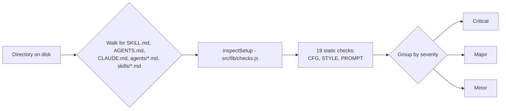

# Prompt Auditor

**A deterministic, offline auditor for Claude Code skills, agents, and prompts.**

Plugin `prompt-auditor` · version 0.1.0 · author John Conneely · license <!-- TODO: no LICENSE file exists yet - add one and update this line -->

<!-- Last verified: 2026-09-12 -->

## Overview

Prompt Auditor runs the same static checks against `SKILL.md`, `AGENTS.md`, `CLAUDE.md`,
`agents/*.md`, and `skills/*.md` files that the companion [Left the Chat](#companion-web-app)
web page and its pre-commit hook use, so a plugin, a browser tab, and a git hook can never
drift into three different answers for the same input. Everything runs locally: no model
call, no network request, and no upload is involved in producing a finding.

## What's included

| Component | Count | Notes |
|---|---|---|
| Skill | 1 | `audit`, invoked as `/prompt-auditor:audit` |
| Static checks | 19 | 4 config (`CFG-*`), 3 style (`STYLE-*`), 12 prompt-quality (`PROMPT-*`) |
| CLI | 1 | `scripts/audit.mjs`, callable directly or from the skill |
| Pre-commit hook (optional) | 1 | `tools/audit-staged.mjs`, disabled by default |

There are no custom agents or slash commands in this plugin - the skill is the entry point.

## Skills

| Skill | Description |
|---|---|
| `audit` | Runs the Left the Chat static audit on a directory of skills, agents, or prompts (`SKILL.md`, `AGENTS.md`, `CLAUDE.md`) and prints findings. Use for local review of these. Not for runtime telemetry comparison (use the page) or unrelated code review. |

## Install

```
/plugin install prompt-auditor
```

Verified against `claude plugin validate .` from the repo root.

## Usage

Ask the skill to audit a directory, or run the CLI it wraps directly:

```bash
node scripts/audit.mjs <directory>
```

Findings print grouped critical, then major, then minor, each with an ID, a title, and
a one-line detail explaining why it matters.



`inspectSetup` is the single source of truth for these checks - the CLI (`scripts/audit.mjs`),
the pre-commit hook (`tools/audit-staged.mjs`), and the web page all call the same function
rather than maintaining separate copies.

### Optional pre-commit hook

On first run, the skill offers to enable `tools/audit-staged.mjs` as a pre-commit hook. It
is disabled by default and only ever checks files staged in the current commit, so it stays
fast enough not to get bypassed. This is separate from `tools/hooks/pre-commit`, which runs
the disclosure gate described below and is installed independently via:

```bash
git config core.hooksPath tools/hooks
```

## Configuration

The skill and CLI need no configuration to run. Two related tools do read environment
variables, only when used directly (not part of the plugin's own audit path):

- `tools/disclosure_gate.py` reads `$DISCLOSURE_BLOCKLIST` (path to a terms file) before a
  repository goes public.
- `tools/prepublish.sh` reads `$DISCLOSURE_BLOCKLIST` and `$VOICE_SCRIPTS` and runs the
  disclosure gate, a PII scan, an em-dash check, and an AI-ism check as one pass/fail
  verdict before an irreversible publish.

## Companion web app

The same checks also ship as a small React/Vite page in this repository, for pasting a
prompt directly rather than pointing at files on disk:

```bash
npm install
npm run dev
```

The page adds a runtime half the plugin does not attempt: comparing declared setup against
actual telemetry from a real agent run (Claude Code JSON/JSONL today), with trust levels
that control whether files are pasted once, dropped as a batch, or connected to a
persistent folder. See `src/App.jsx` and `src/lib/` for that half; `npm run build` produces
a single-file `dist/index.html` that can be opened without a server.

`examples/find-ai-events.md` is a task prompt written to trip every `PROMPT-*` check, with
`examples/find-ai-events-fixed.md` alongside it as the corrected version - useful for
seeing the full report shape without writing a prompt from scratch.

## Development

```bash
npm test              # JavaScript checks and CLI behaviour (tests/js/)
python -m pytest      # disclosure gate tests (tests/, pyproject.toml)
npm run build         # standalone production build
```

CI (`.github/workflows/ci.yml`) runs both suites and the build on every pull request and
push to `main`.

## Project shape

- `src/lib/checks.js` - the 19 static checks (`inspectSetup`), shared by the plugin, the
  hook, and the page.
- `scripts/audit.mjs` - CLI entry point the skill calls.
- `tools/audit-staged.mjs` - optional pre-commit hook wrapping the same checks.
- `tools/disclosure_gate.py`, `tools/prepublish.sh` - pre-publish safety gates, unrelated
  to the audit checks themselves.
- `skills/audit/SKILL.md` - the plugin's one skill.

## Hackathon context

Team **Left the Chat**, AI Tinkerers Dublin hackathon, "Agents, Everywhere", 12 September 2026.

## License

<!-- TODO: no LICENSE file exists in this repository yet. Add one and replace this section. -->
